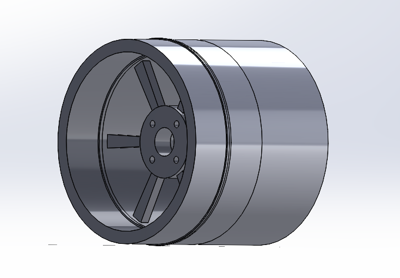
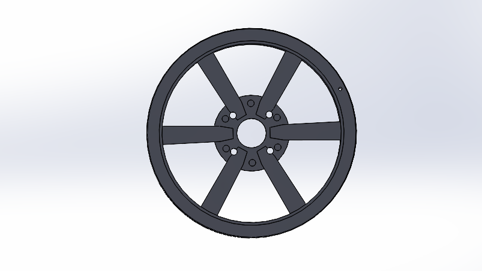

# Volkte67 — Roda JDM 16x7 (Modelos 3D)

Modelos 3D de uma roda aro 16 de 6 raios, estilo JDM, nos formatos **STEP** (CAD editável) e **STL** (impressão 3D / visualização).

<p align="center">
  
  <br>
  <em>Vista em perspectiva</em>
</p>

<p align="center">
  
  <br>
  <em>Vista frontal: 6 raios e cubo com 4 furos de fixação (4x100)</em>
</p>

## Especificações

| Item | Valor |
|---|---|
| Modelo | Volkte67 JDM |
| Aro x tala | 16" x 7" |
| Furação (PCD) | 4x100 |
| Offset | ET35 |
| Raios | 6 |
| Variante da borda | 5R Deep Dish |

## Arquivos

Todos os arquivos estão na pasta [`models/`](./models).

| Arquivo | Formato | Descrição |
|---|---|---|
| `Volkte67_16x7_4x100_ET35.step` | STEP | Roda completa (montagem com 8 peças), 16x7, 4x100, ET35 |
| `Volkte67_16x7_4x100_ET35.stl` | STL | Roda completa, malha para impressão 3D |
| `Volkte67_JDM_16x7_BORDA.step` | STEP | Borda (barril) da roda, peça única |
| `Volkte67_JDM_16x7_5R_DeepDish.stl` | STL | Borda na variante 5R Deep Dish, malha para impressão 3D |

## Dimensões aproximadas

Medidas retiradas da caixa delimitadora (bounding box) dos arquivos STL, em milímetros:

| Modelo | Diâmetro | Profundidade / largura |
|---|---|---|
| Roda completa 16x7 ET35 | ≈ 408,5 mm | 177,8 mm (7") |
| Borda 5R Deep Dish | ≈ 412,4 mm | 356 mm |

> As unidades dos arquivos STL não são registradas no próprio formato. Os valores acima assumem milímetros, o que é coerente com a largura de 177,8 mm (7 polegadas) da roda.

## Como usar

**Visualizar**
- STL: qualquer visualizador 3D, como o do próprio GitHub (clique no arquivo `.stl` para pré-visualizar), MeshLab ou Windows 3D Viewer.
- STEP: FreeCAD, Fusion 360, SolidWorks, Onshape ou outro software CAD.

**Editar**
1. Abra o arquivo `.step` no seu CAD.
2. Ajuste as dimensões ou o design conforme necessário.
3. Exporte novamente em STL, se for imprimir.

**Imprimir em 3D**
1. Abra o `.stl` no seu fatiador (Cura, PrusaSlicer, Bambu Studio etc.).
2. Escale o modelo conforme a proporção desejada. Em miniaturas ou protótipos, use uma escala uniforme (por exemplo 1:10 ou 1:24).
3. Verifique se o modelo cabe na sua mesa de impressão e ajuste suportes e orientação.

## Estrutura do repositório

```
.
├── README.md
├── images/
│   ├── preview-frontal.png
│   └── preview-roda-3d.png
└── models/
    ├── Volkte67_16x7_4x100_ET35.step
    ├── Volkte67_16x7_4x100_ET35.stl
    ├── Volkte67_JDM_16x7_BORDA.step
    └── Volkte67_JDM_16x7_5R_DeepDish.stl
```

## Licença

Defina aqui a licença do projeto (por exemplo, [CC BY-NC 4.0](https://creativecommons.org/licenses/by-nc/4.0/deed.pt-br) para uso não comercial com atribuição, ou MIT). Se não houver licença, todos os direitos ficam reservados ao autor.

## Autor

**Volkte67**
